# Designing a Data Warehouse from Scratch Using Redshift, S3 Bucket, and DBT: An End-to-End Project

## Table of Contents
1. [Introduction](#introduction)
2. [Technologies Used](#technologies-used)
3. [Project Steps](#project-steps)
   1. [Logical View Creation](#logical-view-creation)
   2. [Setting Up the Redshift Data Warehouse](#setting-up-the-redshift-data-warehouse)
   3. [Physical Architecture and Implementation](#physical-architecture-and-implementation)
   4. [Connecting to Redshift Using DBeaver](#connecting-to-redshift-using-dbeaver)
   5. [Building Models and Tests with DBT](#building-models-and-tests-with-dbt)
4. [Conclusion](#conclusion)
5. [References](#references)

## Introduction

This project demonstrates the end-to-end process of designing and implementing a data warehouse using Amazon Redshift, S3 bucket, and DBT (Data Build Tool). The project showcases the integration of various AWS services and modern data engineering practices to create a robust and scalable data warehousing solution.

## Technologies Used

1. **AWS Services**
   - **IAM (Identity and Access Management)**: For managing access and security
   - **VPC (Virtual Private Cloud)**: For network configuration
   - **S3 (Simple Storage Service)**: For data storage
   - **Redshift**: For data warehousing
   - **Glue**: For data cataloging and ETL

2. **DBT (Data Build Tool)**: For data modeling and transformations

3. **Kafka**: For streaming data generation

4. **DBeaver**: As the SQL client for database management

## Project Steps

### Logical View Creation

The project began with creating a logical view of the data warehouse using draw.io. This view comprises the dimensions and facts tables, providing a clear structure for the data model.

### Setting Up the Redshift Data Warehouse

#### 1. VPC Configuration

- Created a VPC with the following specifications:
  - IPv4 CIDR block
  - 1 availability zone
  - 1 public subnet
  - 1 private subnet
- Cluster subnet groups were created
- Other VPC configurations were left as default

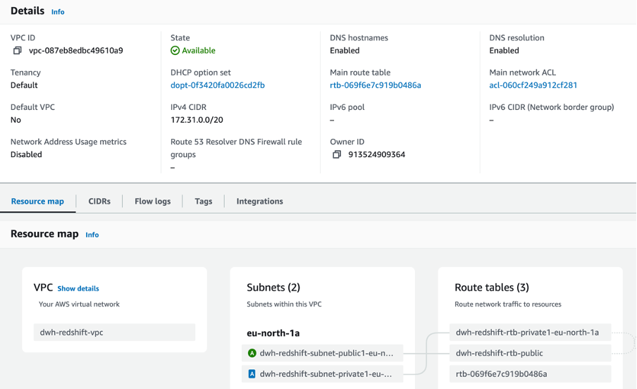

#### 2. Redshift Cluster Creation

- Used dc2.large node type with 1 node
- Set up admin username and password
- **Note**: For higher data volumes, more nodes can be utilized

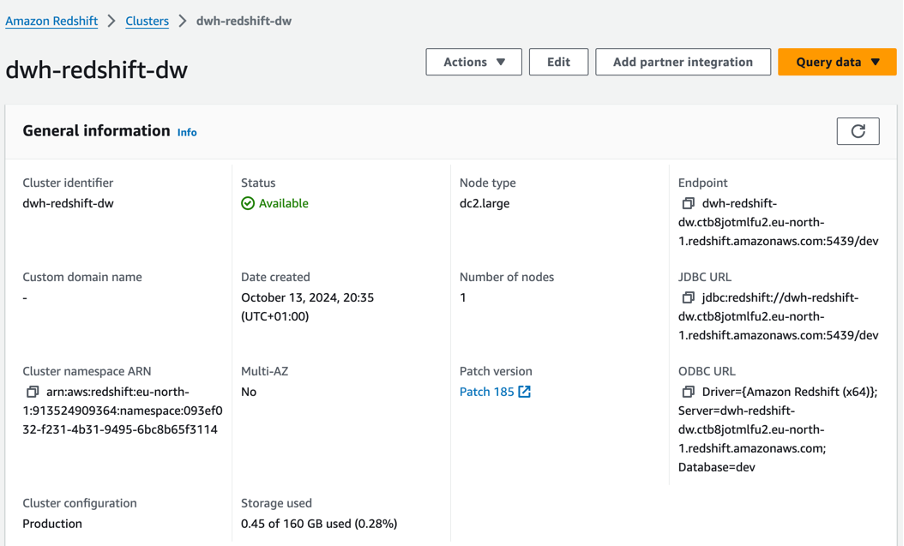

#### 3. IAM Role Configuration

- Created an IAM role with access to S3 buckets

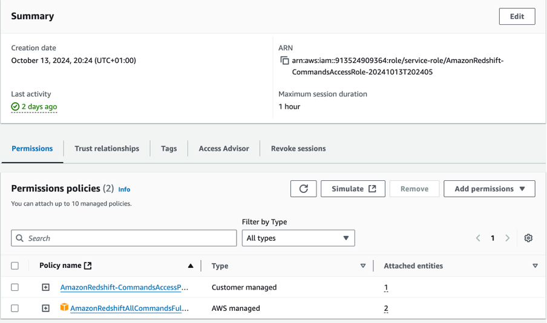

#### 4. VPC Security Group Setup

- Configured inbound and outbound rules
- Set "My IP address" for both inbound and outbound rules

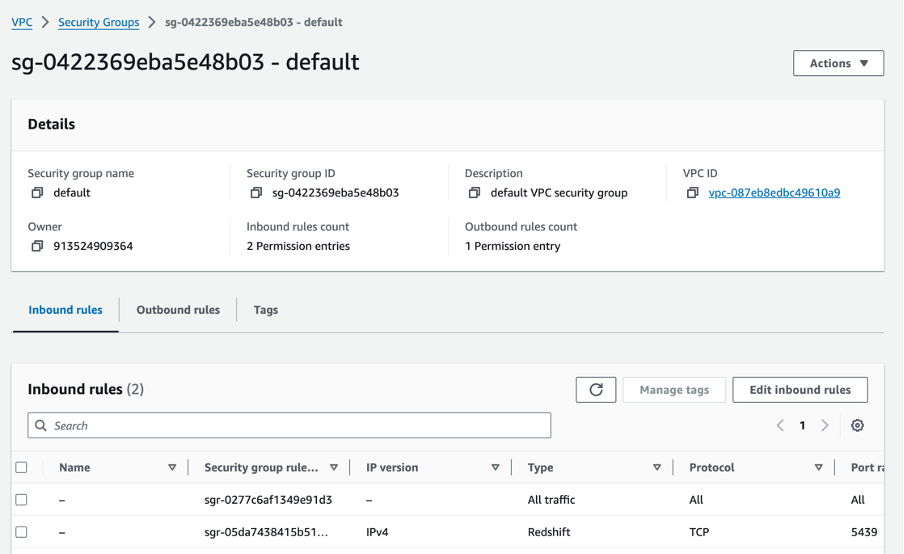

### Physical Architecture and Implementation

#### 1. Data Generation

- Utilized Kafka to generate data for dimensions and facts tables

#### 2. Data Storage in S3

- Moved the generated data to an S3 bucket

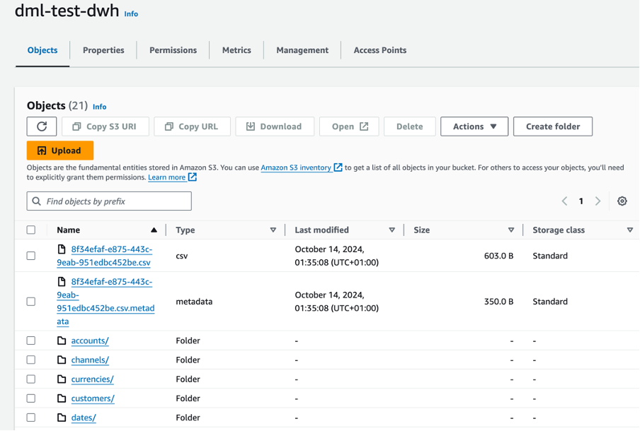

#### 3. AWS Glue Configuration

- Created crawlers and classifiers
- Used pipe separator as the classifier based on data structure
- Created a database using AWS Glue
- Set crawler schedule to on-demand for manual runs

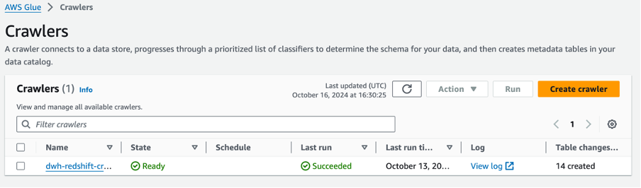
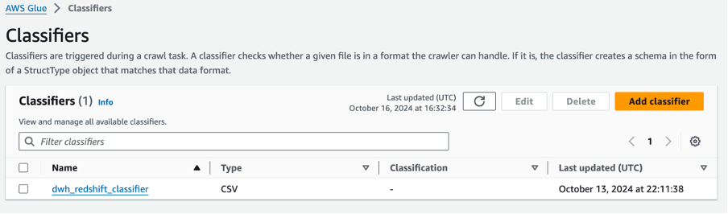
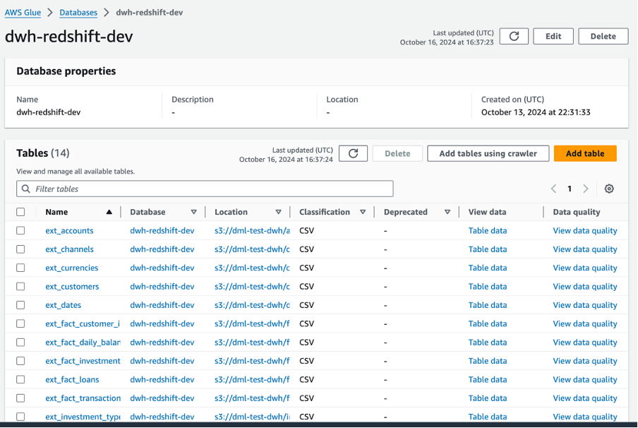

### Connecting to Redshift Using DBeaver

- Established connection to Redshift data warehouse using DBeaver IDE
- Implemented the Medallion Architecture for schema design:
  - Bronze layer: Raw, unprocessed data
  - Silver layer: Cleansed and standardized data
  - Gold layer: Highly refined, analytics-ready data

> **Note**: The query used to create the bronze schema in DBeaver is as follows:

## Bronze Schema SQL

```sql
CREATE EXTERNAL SCHEMA dev_bronze
FROM DATA CATALOG 
DATABASE 'dwh-redshift-dev'
IAM_ROLE 'arn:aws:iam::913524909364:role/service-role/AmazonRedshift-CommandsAccessRole-20241014T010823'
REGION 'us-north-1';
```

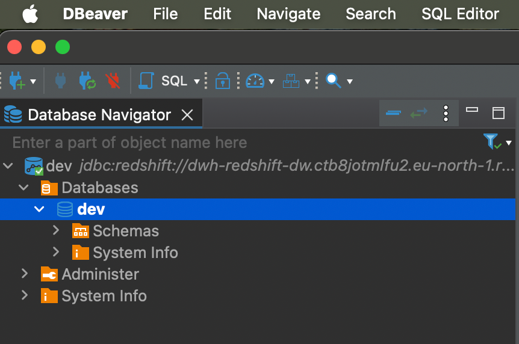

### Building Models and Tests with DBT

- Utilized DBT for building data models and implementing tests

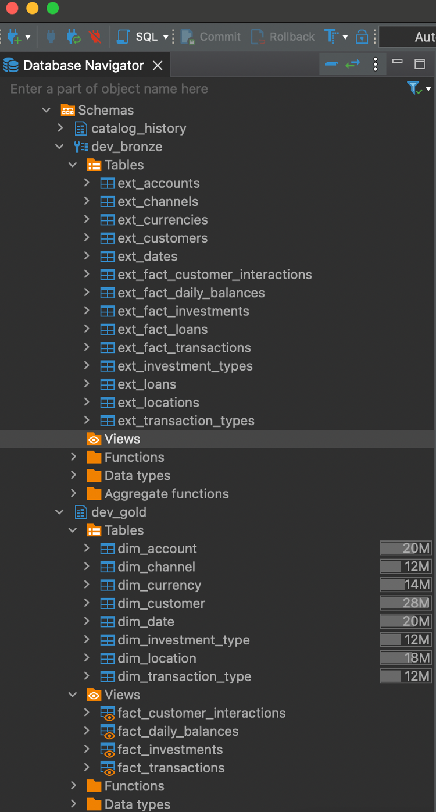
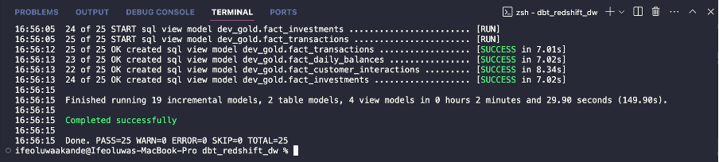

## Conclusion

This project demonstrates a comprehensive approach to designing and implementing a data warehouse using modern cloud technologies and data engineering practices. By leveraging AWS services, DBT, and following the Medallion Architecture, I've created a scalable and efficient data warehousing solution that can handle raw data ingestion, transformation, and analytics-ready data serving.

## References

1. Amazon Web Services. (n.d.). Amazon Redshift. Retrieved from https://aws.amazon.com/redshift/
2. dbt Labs. (n.d.). Data Build Tool (dbt). Retrieved from https://www.getdbt.com/
3. Apache Software Foundation. (n.d.). Apache Kafka. Retrieved from https://kafka.apache.org/

---

*Credit: This project is based on a course curated by @codewithyu.*
